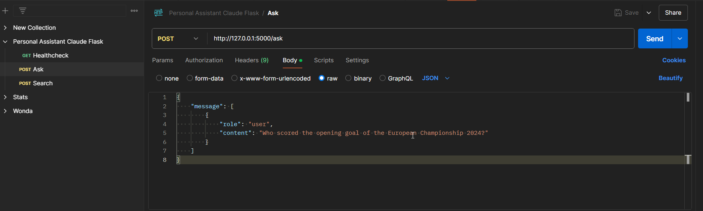

# About

Backend app for personal-assistant-app-fe. Written in Python, using Flask, LangChain, Claude API.
Consists of two API endpoints (ask, search) whereas ask is the normal interaction with Claude API and ask uses additionally the SERP API functionality to query latest news that are not part of the Claude training corpus yet.

## 1. Create venv
``python3 -m venv venv``

## 2. Activate venv
``source venv/bin/activate``
OR
``venv\Scripts\activate``

## 3. Install dependencies
``pip install -r requirements.txt``

## 4. Start app
``python3 main.py``